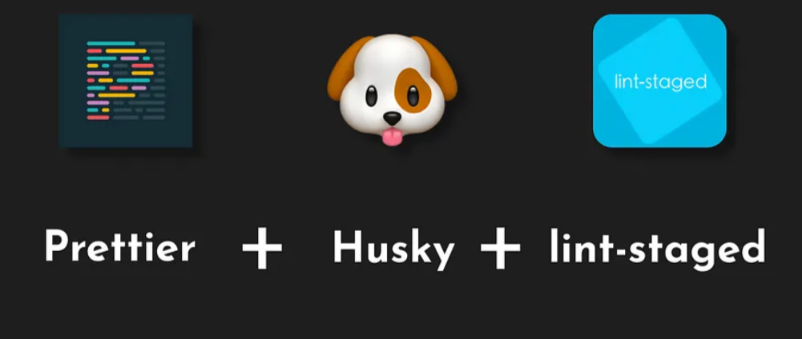

<h1 align="Center">Pre-Commit Hook (Husky + lint-staged)</h1>

<h4 align="center">



</h4>

* Pre-commit Hook


<!--
 **Pre-commit Hook**

## PRETTIER - SET UP

Index (Official Sources):

1. Prettier · Opinionated Code Formatter
2. What is Prettier? · Prettier
3. Editor Integration · Prettier
4. Install · Prettier
5. Options · Prettier
6. Ignoring Code · Prettier
1. javascript - How can I base a .prettierignore file on .gitignore? - Stack Overflow
7. https://www.digitalocean.com/community/tutorials/how-to-format-code-with-prettier-in-visual-studio-code#step-2-formatting-code-on-save
8. Watching For Changes · Prettier
9. Pre-commit Hook · Prettier
10. CLI · Prettier

Video Tutorials - Prettier - Husky Lint-staged Set up:
1. Code Made Simple - How to fail fast with Husky - npm git commit hooks
url: https://www.youtube.com/watch?v=THCtQ7CkV1g
2. Web Dev Simplified - How To Setup Prettier
url: https://www.youtube.com/watch?v=DqfQ4DPnRqI
3. Monsterlessons Akademy - Lint Staged With Husky for Pre-commit Validations
url: https://www.youtube.com/watch?v=_ssKvmZqSnk
4. Automate Code Formatting with Pre-commit Hooks: Husky, lint-staged & Prettier
https://www.youtube.com/watch?v=182_X9iqCqo
5. Kevin Powell - Formatting your code is a waste of time - use Prettier instead
url: https://www.youtube.com/watch?v=8k-b-7rJAeU
6. Git hooks with Husky - No bad commits any more
url: https://www.youtube.com/watch?v=-qHA6zbOdLc
7. JavaScript Talks - React Course - Ep 1.1 - Setup Prettier
url: https://www.youtube.com/watch?v=ChKBhmsnXKI


## Prettier Set-up

### 1 - Prettier Extension installation:
url: Editor Integration · Prettier

### 2 - Prettier installation:
url: Install · Prettier

2.1 - Prettier locally installation as a dev dependency (last version)
CLI: npm install --save-dev --save-exact prettier

2.2 - Prettier Specific Version local Installation as a dev dependency
(installation of prettier version 2.6.0 compatible with npm version 12.22.12)
CLI: npm install prettier@2.6.0 --save-dev


3 - Prettier Config File:
url: Install · Prettier
url: Options · Prettier

3.1 - Creation of prettier config file "pretierrc"
CLI: node --eval "fs.writeFileSync('.prettierrc','{}\n')"

3.2 - "prettierrc" config file Set-up

```
{
  "trailingComma": "all",
  "semi": true,
  "singleQuote": false,
  "printWidth": 80,
  "overrides": [
    {
      "files": "*.json",
      "options": {
        "semi": false,
        "tabWidth": 2
      }
    },
    {
      "files": ["*.html", "src/*.ts"],
      "options": { "tabWidth": 4 }
    }
  ]
}
```
4 - Add a ".prettierignore" file
	- To exclude files from formatting, create a .prettierignore file in the root of your project. .prettierignore uses gitignore syntax.
url: Install · Prettier
url: Ignoring Code · Prettier


4.1 - "prettierignore"  file Set-up

```
#Flagged .gitignore file (script on package.json)
# Ignore Folder:
.github/
.vscode/
docs/
# Ignore Specific Files
.gitignore
.prettierignore
.prettierrc
# Ignore File Formats with exception of TypeScript & React
*.js
*.json
*.md 
!*.ts
!*.tsx
```

4.2 - Flag ".gitignore" file to ".prettierignore" file to extend exclusions
url: javascript - How can I base a .prettierignore file on .gitignore? - Stack Overflow

	- Add the following script to "package.json" file:

```
"scripts": {
    "prettier": "--ignore-path .gitignore"
  },
```

5 - Run Prettier (independently from CLI)

url: Install · Prettier

	- Run Prettier Code Formatter:
		- CLI: npx prettier . --write

	- Check formated files:
		- CLI: npx prettier . --check

6 - Format on Save:

url: https://www.digitalocean.com/community/tutorials/how-to-format-code-with-prettier-in-visual-studio-code#step-2-formatting-code-on-save

On VS Code Settings search for "code formatter" select "Prettier" as the standard code formatter and tick the box on "format on save", this will generate a ".vscode" folder with a "settings.json " file inside with the following script:

"settings.json"  file format on save set-up:

```
{
    "editor.formatOnSave": true,
    "editor.defaultFoldingRangeProvider": "esbenp.prettier-vscode",
    "editor.defaultFormatter": "esbenp.prettier-vscode"
}
```

7 - Format on Change (Watching for changes):

URL: Watching For Changes · Prettier
url: onchange - npm (npmjs.com)

	- You can have Prettier watch for changes from the command line by using onchange. For example:

7.1 - Install Node "onchange" package:
		- url: onchange - npm (npmjs.com)

CLI: npm install onchange

And run the following command (doesn´t work)

CLI: npx onchange "**/*" -- npx prettier --write --ignore-unknown {{changed}}

7.2 - OR add a script to "package.json":

	- Add the following script to the "package.json" file (Work´s)

```
{
  "scripts": {
    "prettier-watch": "onchange \"**/*\" -- prettier --write --ignore-unknown {{changed}}" 
  } 
}
```

	- run prettier on watch
		- CLI: npm run prettier-watch

8 - Pre-Commit Hook

url: Pre-commit Hook · Prettier
url: lint-staged/lint-staged: 🚫💩 — Run linters on git staged files (github.com)
url: typicode/husky: Git hooks made easy 🐶 woof! (github.com)


#Lint-stage Installation
url: https://github.com/lint-staged/lint-staged


lint-stage configuration
url: https://github.com/lint-staged/lint-staged#configuration

#husky Installation -> sets the hooks
url: https://git-scm.com/docs/githooks
url: https://github.com/typicode/husky
url: https://typicode.github.io/husky/
url: https://typicode.github.io/husky/guide.html


#Install the lint-staged module od NodeJs as a dev. dependency
CLI: npm install --save-dev lint-staged

#Install the hodule module od NodeJs as a dev. dependency
CLI: npm install --save-dev husky


# Add a .husky/pre-commit file to set the "pre-commit Hook" with a shell script that will trigger the linters included in the lint-staged script to be added in the "package.json".
CLI: npx husky-init

The following script should appear in the "package.json" file:

{
  "scripts": {
    "prepare": "husky install"
  },
}

# Add to the "package.json" file the following scripts:
// This will execute the "lint-staged" commands when triggered by the husky pre-commit hook, upon a commit of the staged files (git add .)

{
  "scripts": {
    "precommit": "lint-staged",
  },
  "husky": {
    "hooks": {
      "pre-commit": "npm run precommit"
    }
  },
  "lint-staged": {
    "src/**/*.{ts,tsx,js,jsx,css,scss,html}": [
      "prettier --write"
    ]
  },
}


# Add to the "package.json" file the following property:
// This will set the "linters" to be executed and the directories/ file types to be included on the pre-commit hook.

{
  },
  "lint-staged": {
    "src/**/*.{ts,tsx,js,jsx,css,scss,html}": [
      "prettier --write"
    ]
  },
}

# Testing a Pre-commit Hook with Prettier

CLI: git add .
CLI git commit - "Pre-commit Hook trial"


-->
